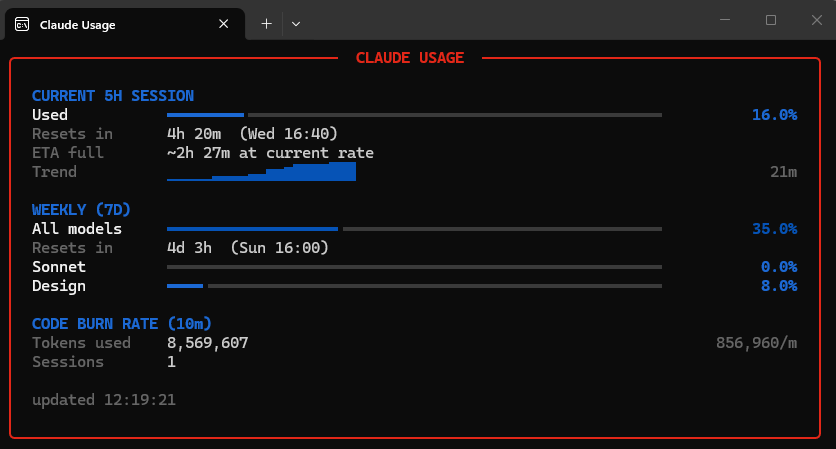

# Claude Usage Widget

Monitor your **real** Claude.ai usage limits — the same numbers shown under
Settings > Usage, but always visible, refreshed automatically, and with extras
like burn-rate estimates and trend logging.

Available as a **native macOS menu-bar app** (Swift/SwiftUI) and a
**Windows terminal widget** (Python/Rich).

Both versions call the same undocumented private API the Claude apps use
internally, so you see the exact figures — not estimates from local logs.

## Caveats — read this first

- **Undocumented API.** Anthropic doesn't publish this endpoint. It can change
  or break at any time.
- **TOS grey area.** Polling a private API with a session cookie is not
  explicitly endorsed. A sensible poll interval (60 s) is unlikely to draw
  attention, but use at your own risk.
- **Cookie expiry.** Session cookies last as long as your browser session —
  typically weeks. When they expire the widget tells you and you sign in again.

---

## macOS (menu-bar app)

A native Swift/SwiftUI app that lives in your menu bar. One-click sign-in via
an embedded browser, no cookie pasting required.

### Features

- Circular progress arc in the menu bar — color shifts through the Claude
  palette as usage rises (tan > orange > deep > red).
- Popover with 5 h session usage, 7-day rolling usage, per-model breakdown
  (Sonnet / Opus / Design), and extra-usage spend.
- Burn-rate estimate: "limit in ~53 m - 2.3 %/min" with a warning when you'll
  hit 100 % before the session resets.
- Persistent sign-in — uses a real WebKit session, so you only log in once.
- Logs every poll to CSV (`usage-log.csv`) and keeps a short history for the
  burn-rate sparkline.

### Requirements

- macOS 14 (Sonoma) or later
- Xcode or Swift toolchain (for building from source)

### Build & run

```bash
cd macos
chmod +x build.sh
./build.sh          # builds with SPM, assembles .app bundle in dist/
open dist/Claude\ Usage.app
```

The app appears as a menu-bar icon. Click it to see the popover.
On first launch it opens a sign-in window automatically.

### Manual setup (alternative)

If you prefer not to use the browser sign-in:

1. Get your `org_id` and cookie string (see "Getting credentials" below).
2. Click **Settings** in the popover > **Manual Setup**, paste both values, Save.

Config is stored in `~/Library/Application Support/ClaudeUsage/config.json`
(owner-only permissions, `chmod 600`).

---

## Windows (terminal widget)

A Python terminal widget rendered with [Rich](https://github.com/Textualize/rich)
and TLS-fingerprinted requests via
[curl_cffi](https://github.com/lexiforest/curl_cffi).



### Features

- Live 5 h session and 7-day usage bars with ETA prediction.
- Sparkline trend from recent history.
- Desktop notifications (Windows toast) at configurable thresholds.
- CSV log + `graph.py` for charting usage over time.

### Requirements

- Python 3.10+
- Windows (desktop toasts are Windows-only; everything else is cross-platform)

### Setup

```bash
cd windows
pip install -r requirements.txt
cp config.example.json config.json   # then edit with your credentials
python claude_usage_widget.py
```

### Auto-start on Windows

Save a `.cmd` launcher and drop a shortcut in `shell:startup`:

```cmd
@echo off
start "" wt.exe -F --pos 2660,-441 --size 80,30 cmd /k "python C:\path\to\claude_usage_widget.py"
```

### Generating a graph

```bash
python graph.py            # last 7 days
python graph.py --days 30  # last N days
python graph.py --all      # entire log
```

### Refreshing the cookie

When the cookie expires:

- **Manual:** edit `config.json`, paste the new cookie.
- **Helper:** `powershell .\refresh-cookie.ps1`

---

## Getting credentials (manual method)

1. Open [claude.ai](https://claude.ai) in Chrome, sign in.
2. DevTools (`F12`) > Network > **Fetch/XHR** > navigate to Settings > Usage.
3. Click the `usage` request.
4. The **Request URL** contains your `org_id`:
   `https://claude.ai/api/organizations/<UUID>/usage`
5. Scroll to **Request Headers** > **Cookie** > copy the full value.

---

## Files created at runtime

| File | Location | Purpose |
|---|---|---|
| `config.json` | App Support (macOS) or working dir (Windows) | Credentials — never commit |
| `history.json` | Same | Recent samples for ETA / sparkline |
| `usage-log.csv` | Same | Append-only poll log |
| `usage-graph.png` | Windows working dir | Generated by `graph.py` |

All are in `.gitignore`.

## License

MIT — see [LICENSE](LICENSE).

## Credit

Built by [Devairen](https://github.com/Devairen) with
[Claude Code](https://claude.ai/code).
